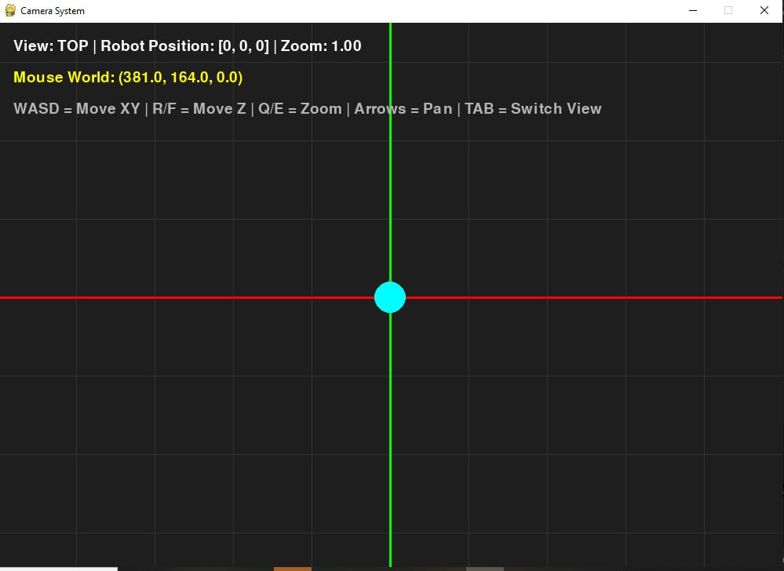
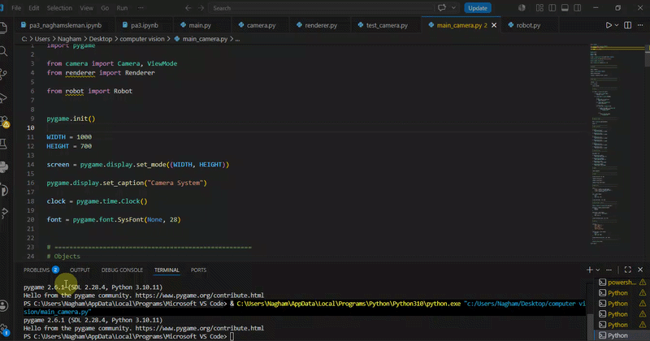

# Camera System

Flexible camera system for 2D renderer architecture using Python and Pygame.

---

## Features

- Top view projection
- Left view projection
- Smooth camera following
- Camera zoom in/out
- Camera panning
- World-to-screen transformation
- Screen-to-world transformation
- Modular renderer architecture

---

## Controls

| Key | Action |
|---|---|
| W A S D | Move robot on X/Y |
| R / F | Move robot on Z |
| Q / E | Zoom in/out |
| Arrow Keys | Pan camera |
| TAB | Switch camera view |

---

## Architecture

```text
camera-system/
│
├── renderer/
│   ├── camera.py
│   └── renderer.py
│
├── entities/
│   └── robot.py
│
├── docs/
│   ├── result.jpg
│   └── robot.mp4
│
├── main.py
├── README.md
├── requirements.txt
└── .gitignore
```

---

## Architecture Diagram



---

## Demo Video



---

## Coordinate Systems

### World Space

3D coordinates inside the simulation world.

Example:

```text
(100, 50, 20)
```

### Screen Space

2D pixel coordinates rendered on the screen.

Example:

```text
(500, 300)
```

---

## Projection Modes

### Top View

Projects:

```text
(X, Y)
```

### Left View

Projects:

```text
(X, Z)
```

---

## Camera Features

- Object following
- Smooth movement
- Zoom scaling
- Coordinate transformations
- Camera panning

---

## Install

```bash
pip install -r requirements.txt
```

---

## Run

```bash
python main.py
```

---

## Technologies

- Python
- Pygame
